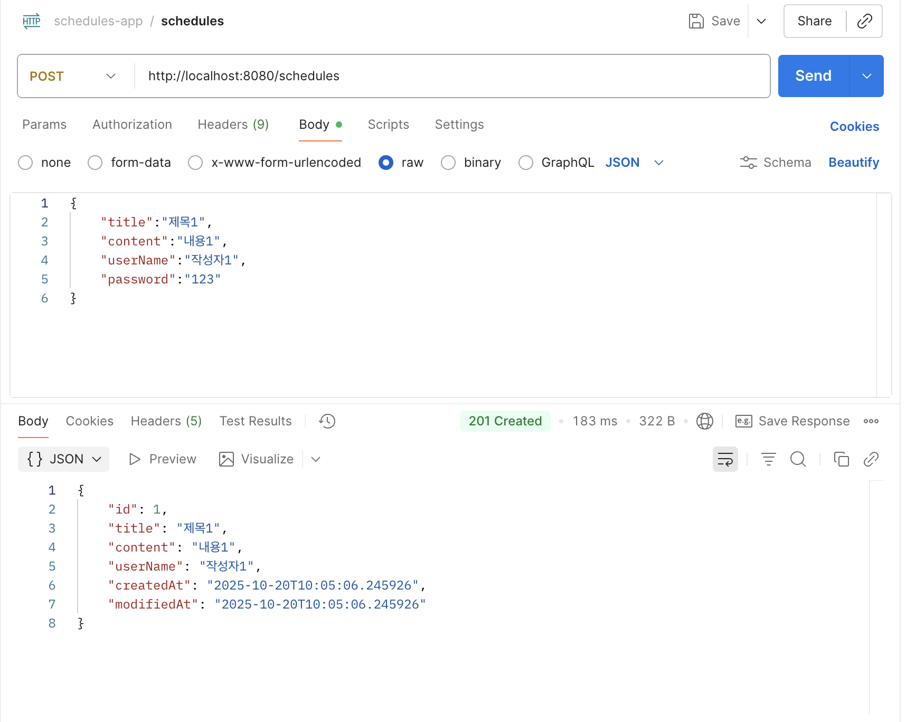
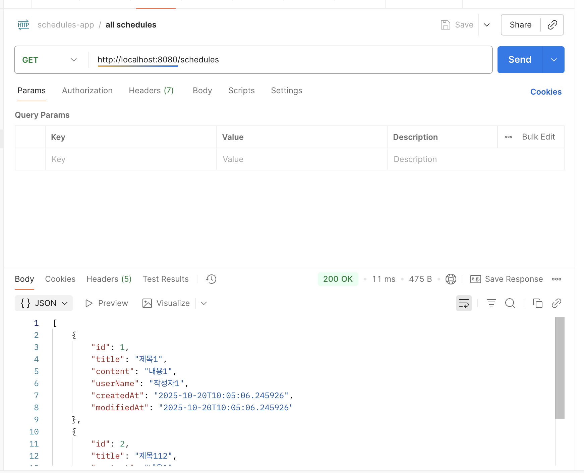
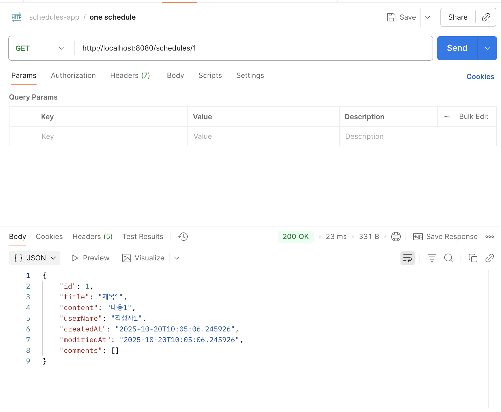
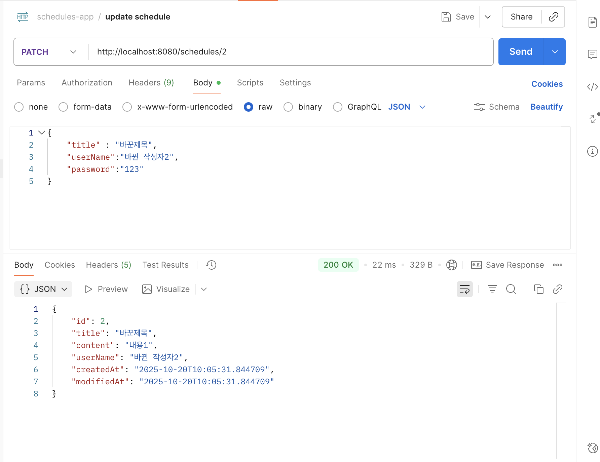
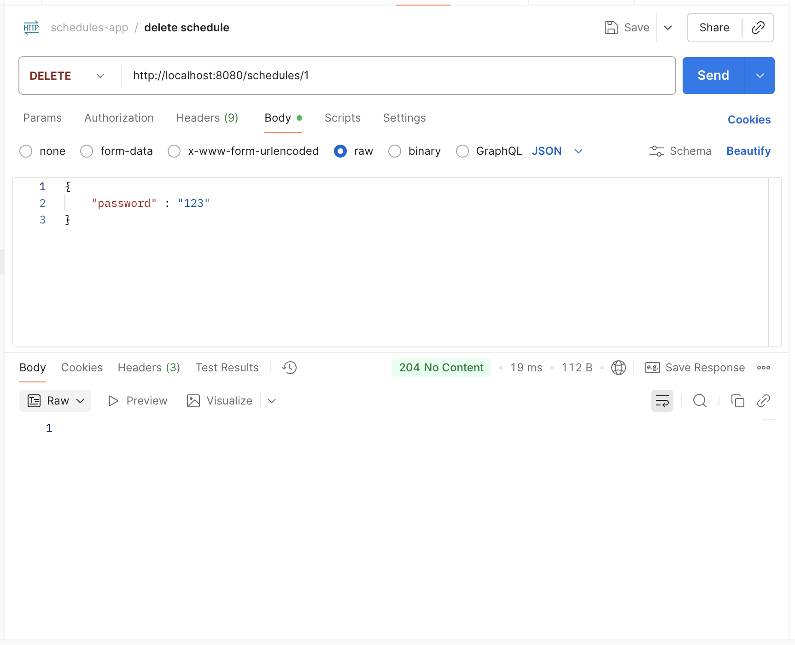
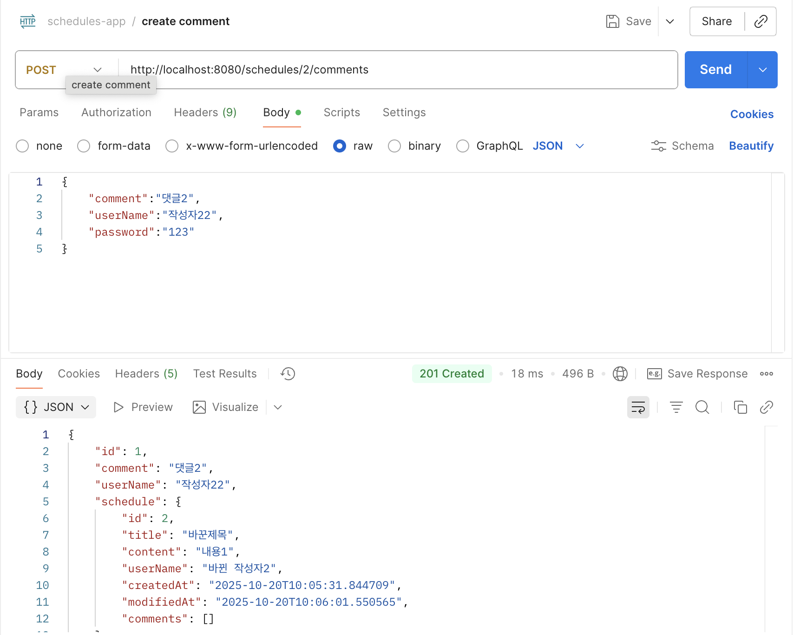
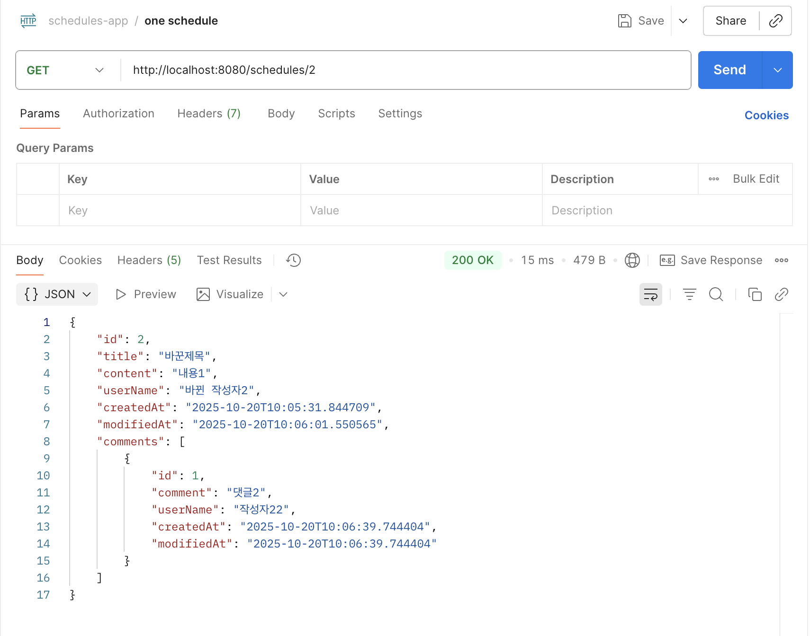

## 📌 일정 관리
* 일정 CRUD 기능 구현
* 댓글 기능 구현
* ERD : https://www.erdcloud.com/d/tbihMkYNCw53hewnc
* API 명세서 : https://singiseoptest.notion.site/API-2920d4e5c90d8087ad16c0e563b3f257?source=copy_link

---
3 Layer Architecture(Controller, Service, Repository)를 적절히 적용했는지 확인해 보고, 왜 이러한 구조가 필요한가 ?
 * 애플리케이션을 역할에 따라 Controller, Service, Repository 3개의 계층으로 나누는 설계 방식이다. 이렇게 계층을 나누면 코드의 책임이 분리되고 유지보수가 쉬워진다
   

@RequestParam, @PathVariable, @RequestBody 이 각각 어떤 어노테이션인지, 어떤 특징을 갖고 있는지 작성해 주세요.
    
 * @RequestParam : URL의 '?' 뒤에 오는 파라미터를 매핑(예: /users?id=23) 
 * @PathVariable : URL 경로에 포함된 값을 변수로 매핑(예: /users/10)
 * @RequestBody : HTTP 요청의 본문(body)에 있는 데이터(JSON 등)를 객체로 변환

---
## 🖼️ PostMan 실행 이미지

